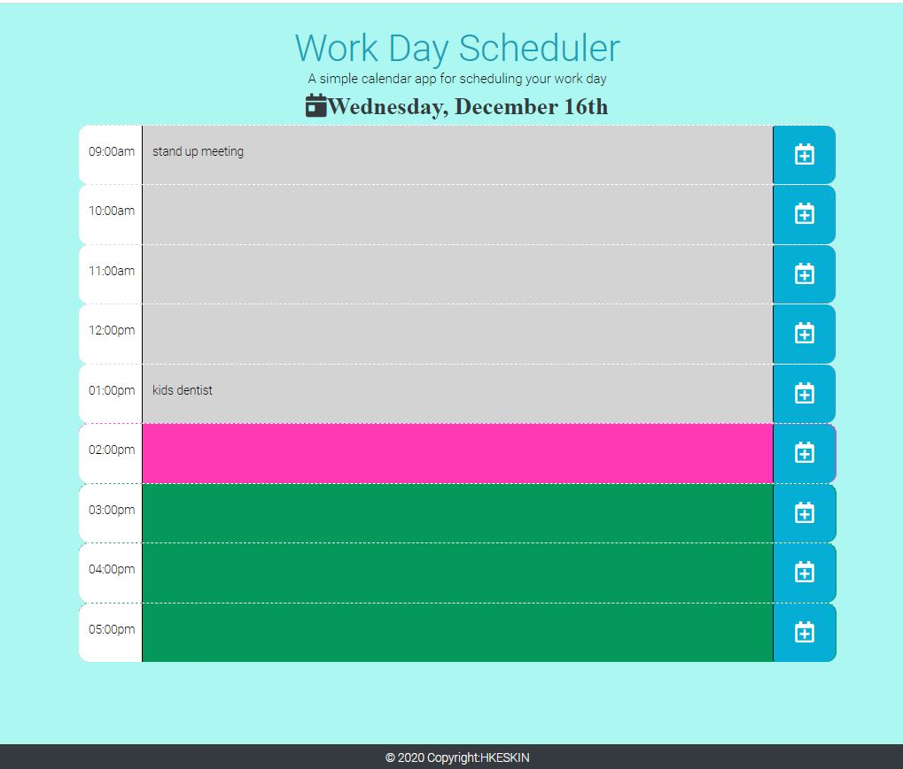

# 05 Third-Party APIs: Work Day Scheduler H.Keskin

## How it Works

* Day calendar: Hours in the work day from 9AM-5PM
* Time blocks starts with time of the day, includes input field for the notes or events and Save icon at last column.
* Each event can be entered in the input field and save icon will save the eventinto the local storage.
* When you refresh the page you still see the events entered and saved.
* Each time block is color changes if it is in the past -gray, if it is now pink and if it is in the future we will have a green color block. 
* This application uses moment.js,[Moment.js](https://momentjs.com/) to work with dates and times besides jquery and Bootstrap.

## Review

Submitted BOTH of the following for review:
* The URL of the functional, deployed application:https://kinziva.github.io/HKcalendar/
* The URL of the GitHub repository: https://github.com/kinziva/HKcalendar
 
